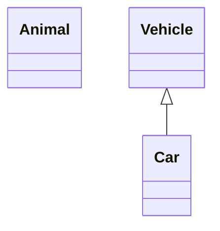
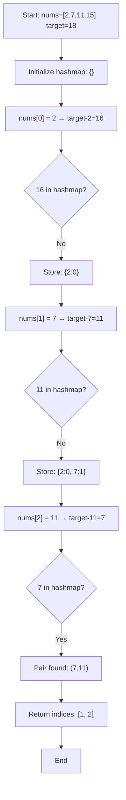

# Two Sum

```mermaid
classDiagram
    class Animal
    Vehicle <|-- Car
```

```mermaid
flowchart TD
    A["Start: nums=[2,7,11,15], target=18"] --> B["Initialize hashmap: {}"]

    B --> C["nums[0] = 2 → target-2=16"]
    C --> D{"16 in hashmap?"}
    D -- "No" --> E["Store: {2:0}"]

    E --> F["nums[1] = 7 → target-7=11"]
    F --> G{"11 in hashmap?"}
    G -- "No" --> H["Store: {2:0, 7:1}"]

    H --> I["nums[2] = 11 → target-11=7"]
    I --> J{"7 in hashmap?"}
    J -- "Yes" --> K["Pair found: (7,11)"]

    K --> L["Return indices: [1, 2]"]
    L --> Z["End"]

```
