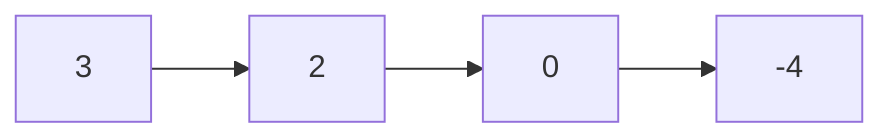
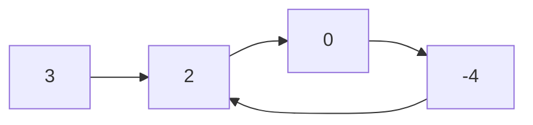

## 141. Linked List Cycle

-  [LeetCode](https://leetcode.com/problems/linked-list-cycle/) | [LeetCode CH](https://leetcode.cn/problems/linked-list-cycle/) (Easy)

-   Determine if a linked list has a cycle in it.

