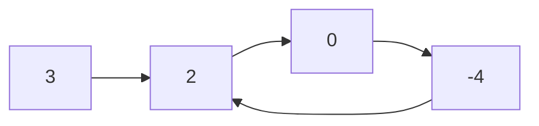

## 142. Linked List Cycle II

-  [LeetCode](https://leetcode.com/problems/linked-list-cycle-ii/) | [LeetCode CH](https://leetcode.cn/problems/linked-list-cycle-ii/) (Medium)

-   Given a linked list, return the node where the cycle begins. If there is no cycle, return `None`.

