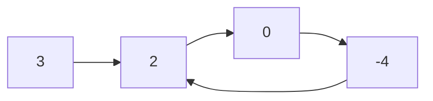

## 142. Linked List Cycle II

-   Given a linked list, return the node where the cycle begins. If there is no cycle, return `None`.

```mermaid
graph LR
A[3] --> B[2]
B --> C[0]
C --> D[-4]
D --> B
```
