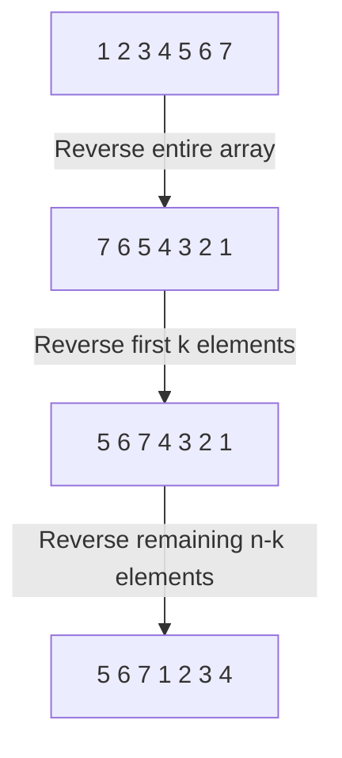

- Rotate array with reversing subarrays

```mermaid
graph TD
    A[1 2 3 4 5 6 7] --Reverse entire array--> B[7 6 5 4 3 2 1]
    B --Reverse first k elements--> C[5 6 7 4 3 2 1]
    C --Reverse remaining n-k elements--> D[5 6 7 1 2 3 4];
```
