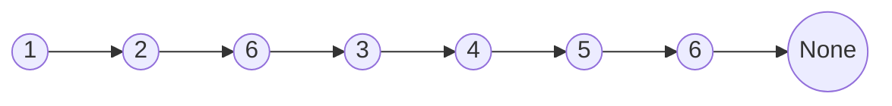
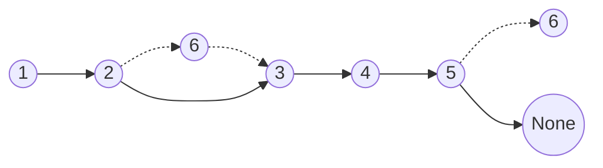

## 203. Remove Linked List Elements

-  [LeetCode](https://leetcode.com/problems/remove-linked-list-elements/) | [LeetCode CH](https://leetcode.cn/problems/remove-linked-list-elements/) (Easy)

-   Remove all elements from a linked list of integers that have value `val`.

-   Before

-   After

