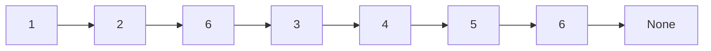
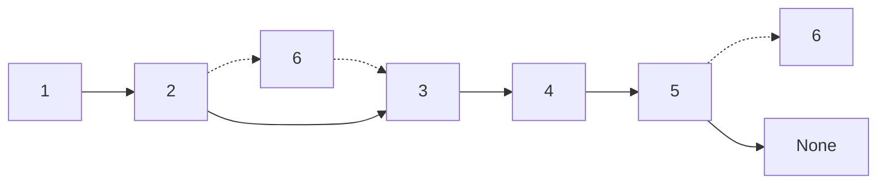

## 203. Remove Linked List Elements

-   Remove all elements from a linked list of integers that have value `val`.

-   Before

```mermaid
graph LR
A[1] --> B[2]
B --> C[6]
C --> D[3]
D --> E[4]
E --> F[5]
F --> G[6]
G --> H[None]
```

-   After

```mermaid
graph LR
A[1] --> B[2]
B -.-> C[6]
C -.-> D[3]
D --> E[4]
E --> F[5]
F -.-> G[6]
B --> D[3]
F --> I[None]
```
