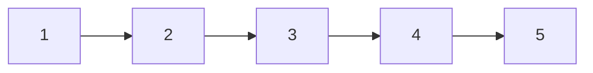
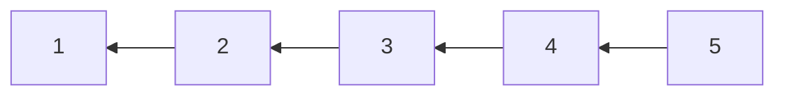

## 206. Reverse Linked List

-   Reverse a singly linked list.

```mermaid
graph LR
A[1] --> B[2]
B --> C[3]
C --> D[4]
D --> E[5]
```

```mermaid
graph RL
E[5] --> D[4]
D --> C[3]
C --> B[2]
B --> A[1]
```
