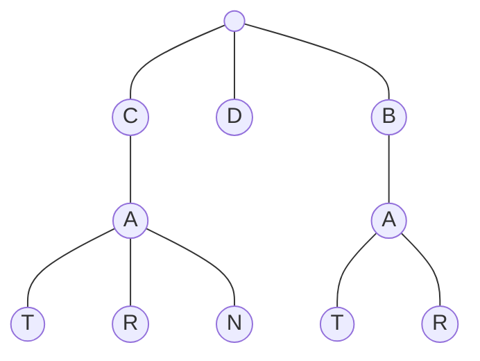

## 208. Implement Trie (Prefix Tree)

-  [LeetCode](https://leetcode.com/problems/implement-trie-prefix-tree/) | [LeetCode CH](https://leetcode.cn/problems/implement-trie-prefix-tree/) (Medium)

## Trie

-   A trie is a tree-like data structure whose nodes store the letters of an alphabet.

