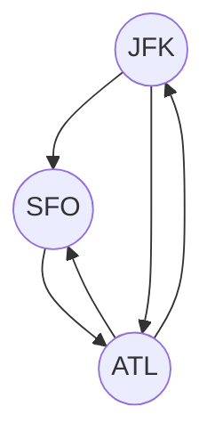

## 332. Reconstruct Itinerary

-   Return the itinerary in order that visits every airport exactly once.
-   The starting airport is `JFK`.
-   If there are multiple valid itineraries, return the lexicographically smallest one.
-   Eulerian path: A path that visits every edge exactly once.

