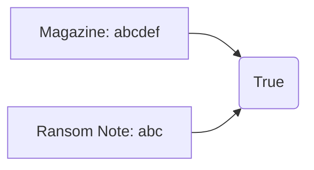

-   Return `True` if the ransom note can be constructed from the magazines, otherwise, return `False`.

```mermaid
graph LR
    A["Magazine: abcdef"] --> C(True)
    B["Ransom Note: abc"] --> C
```
