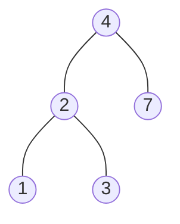

## 700. Search in a Binary Search Tree

-  [LeetCode](https://leetcode.com/problems/search-in-a-binary-search-tree/) | [LeetCode CH](https://leetcode.cn/problems/search-in-a-binary-search-tree/) (Easy)

### Binary Search Tree

1. Binary Tree
2. Left subtree of a node contains only nodes with keys less than the node's key
3. Right subtree of a node contains only nodes with keys greater than the node's key
4. The left and right subtree each must also be a binary search tree
5. There must be no duplicate nodes
6. Inorder traversal of a BST gives a sorted list of keys

