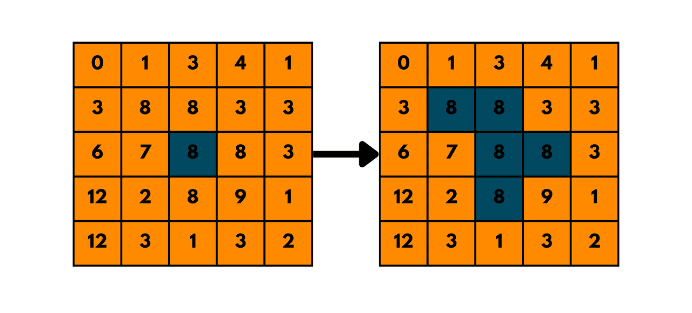

## 733. Flood Fill

-  [LeetCode](https://leetcode.com/problems/flood-fill/) | [LeetCode CH](https://leetcode.cn/problems/flood-fill/) (Easy)

-   Replace all the pixels of the same color starting from the given pixel.
-   In other words, find the connected component of the starting pixel and change the color of all the pixels in that component.
-   Edge cases: If the starting pixel is already the target color, return the image as it is.
-   **Flood Fill** is essentially a graph traversal algorithm (like BFS or DFS) applied to matrices (2D grids).
    It checks adjacent cells (up, down, left, right) of a starting point to determine whether they belong to the same region.
    Typically, it involves modifying or marking the cells that belong to the same connected component.

{width=300px}

|  1  |   1   |  1  |
| :-: | :---: | :-: |
|  1  | ==1== |  0  |
|  1  |   0   |  1  |

|  1  |   1   |  1  |
| :-: | :---: | :-: |
|  1  | ==2== |  0  |
|  1  |   0   |  1  |

|   1   | ==2== |  1  |
| :---: | :---: | :-: |
| ==2== | ==2== |  0  |
|   1   |   0   |  1  |

| ==2== | ==2== | ==2== |
| :---: | :---: | :---: |
| ==2== | ==2== |   0   |
| ==2== |   0   |   1   |
