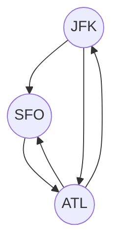
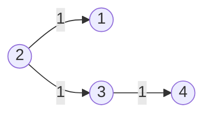
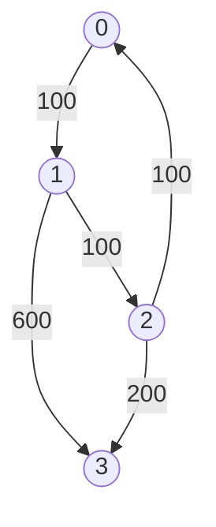

# Advanced Graphs

## 332. Reconstruct Itinerary

-  [LeetCode](https://leetcode.com/problems/reconstruct-itinerary/) | [LeetCode CH](https://leetcode.cn/problems/reconstruct-itinerary/) (Hard)

-   Return the itinerary in order that visits every airport exactly once.
-   The starting airport is `JFK`.
-   If there are multiple valid itineraries, return the lexicographically smallest one.
-   Eulerian path: A path that visits every edge exactly once.



=== "Python"

    ```python
    --8<-- "0332_reconstruct_itinerary.py"
    ```

=== "C++"

    ```cpp
    --8<-- "cpp/0332_reconstruct_itinerary.cc"
    ```

=== "TypeScript"

    ```typescript
    --8<-- "ts/0332_reconstruct_itinerary.ts"
    ```

## 1584. Min Cost to Connect All Points

-  [LeetCode](https://leetcode.com/problems/min-cost-to-connect-all-points/) | [LeetCode CH](https://leetcode.cn/problems/min-cost-to-connect-all-points/) (Medium)

-   **Tree**: a connected acyclic graph
-   **Spanning Tree**: a subgraph that is a tree and connects all the vertices together
-   **Minimum Spanning Tree (MST)**: a spanning tree with the minimum possible sum of edge weights
-   Prim's Algorithm
    -   Data Structure: Heap
    -   Time Complexity: O(E \* logV)
    -   Space Complexity: O(V + E)
-   Kruskal's Algorithm

    -   Union Find
    -   Time Complexity: O(E \* logV)
    -   Space Complexity: O(V + E)

-   Demonstration

Example graph


MST


=== "Python"

    ```python
    --8<-- "1584_min_cost_to_connect_all_points.py"
    ```

=== "C++"

    ```cpp
    --8<-- "cpp/1584_min_cost_to_connect_all_points.cc"
    ```

=== "TypeScript"

    ```typescript
    --8<-- "ts/1584_min_cost_to_connect_all_points.ts"
    ```

## 743. Network Delay Time

-  [LeetCode](https://leetcode.com/problems/network-delay-time/) | [LeetCode CH](https://leetcode.cn/problems/network-delay-time/) (Medium)

-   Return the minimum time taken to reach all nodes in a network.



-   Shortest Path Problem: Find the shortest path between two vertices in a graph.
-   Dijkstra's Algorithm
    -   Shortest path algorithm
    -   Weighted graph (non-negative weights)
    -   Data Structure: Heap; Hash Set
    -   Time Complexity: O(E \* logV)
    -   Space Complexity: O(V)

=== "Python"

    ```python
    --8<-- "0743_network_delay_time.py"
    ```

=== "C++"

    ```cpp
    --8<-- "cpp/0743_network_delay_time.cc"
    ```

=== "TypeScript"

    ```typescript
    --8<-- "ts/0743_network_delay_time.ts"
    ```

## 778. Swim in Rising Water

-  [LeetCode](https://leetcode.com/problems/swim-in-rising-water/) | [LeetCode CH](https://leetcode.cn/problems/swim-in-rising-water/) (Hard)

-   Return the minimum time when you can reach the target.


=== "Python"

    ```python
    --8<-- "0778_swim_in_rising_water.py"
    ```

=== "C++"

    ```cpp
    --8<-- "cpp/0778_swim_in_rising_water.cc"
    ```

=== "TypeScript"

    ```typescript
    --8<-- "ts/0778_swim_in_rising_water.ts"
    ```

## 269. Alien Dictionary

-  [LeetCode](https://leetcode.com/problems/alien-dictionary/) | [LeetCode CH](https://leetcode.cn/problems/alien-dictionary/) (Hard)

-   Return the correct order of characters in the alien language.

=== "Python"

    ```python
    --8<-- "0269_alien_dictionary.py"
    ```

=== "C++"

    ```cpp
    --8<-- "cpp/0269_alien_dictionary.cc"
    ```

=== "TypeScript"

    ```typescript
    --8<-- "ts/0269_alien_dictionary.ts"
    ```

## 787. Cheapest Flights Within K Stops

-  [LeetCode](https://leetcode.com/problems/cheapest-flights-within-k-stops/) | [LeetCode CH](https://leetcode.cn/problems/cheapest-flights-within-k-stops/) (Medium)

-   Return the cheapest price from `src` to `dst` with at most `K` stops.



<iframe width="560" height="315" src="https://www.youtube.com/embed/5eIK3zUdYmE?si=aBR0VbHXTgNuVlGz" title="YouTube video player" frameborder="0" allow="accelerometer; autoplay; clipboard-write; encrypted-media; gyroscope; picture-in-picture; web-share" referrerpolicy="strict-origin-when-cross-origin" allowfullscreen></iframe>

=== "Python"

    ```python
    --8<-- "0787_cheapest_flights_within_k_stops.py"
    ```

=== "C++"

    ```cpp
    --8<-- "cpp/0787_cheapest_flights_within_k_stops.cc"
    ```

=== "TypeScript"

    ```typescript
    --8<-- "ts/0787_cheapest_flights_within_k_stops.ts"
    ```
