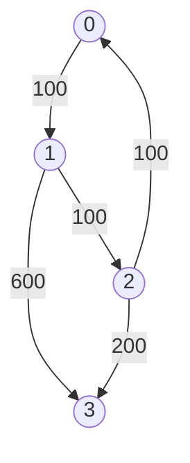

# Advanced Graphs

## LeetCode Problems

1. 0332 - [Reconstruct Itinerary](https://leetcode.com/problems/reconstruct-itinerary/) (Medium)
2. 1584 - [Min Cost to Connect All Points](https://leetcode.com/problems/min-cost-to-connect-all-points/) (Medium)
3. 0743 - [Network Delay Time](https://leetcode.com/problems/network-delay-time/) (Medium)
4. 0778 - [Swim in Rising Water](https://leetcode.com/problems/swim-in-rising-water/) (Hard)
5. 0269 - [Alien Dictionary](https://leetcode.com/problems/alien-dictionary/) (Hard)
6. 0787 - [Cheapest Flights Within K Stops](https://leetcode.com/problems/cheapest-flights-within-k-stops/) (Medium)

## 332. Reconstruct Itinerary

```python
--8<-- "0332_reconstruct_itinerary.py"
```

## 1584. Min Cost to Connect All Points

```python
--8<-- "1584_min_cost_to_connect_all_points.py"
```

## 743. Network Delay Time

```python
--8<-- "0743_network_delay_time.py"
```

## 778. Swim in Rising Water

```python
--8<-- "0778_swim_in_rising_water.py"
```

## 269. Alien Dictionary

```python
--8<-- "0269_alien_dictionary.py"
```

## 787. Cheapest Flights Within K Stops

- Return the cheapest price from `src` to `dst` with at most `K` stops.



```python
--8<-- "0787_cheapest_flights_within_k_stops.py"
```
