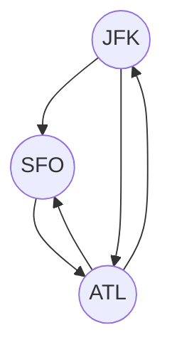
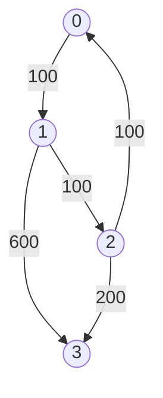

# Advanced Graphs

## 332. Reconstruct Itinerary

-   Return the itinerary in order that visits every airport exactly once.
-   The starting airport is `JFK`.
-   If there are multiple valid itineraries, return the lexicographically smallest one.
-   Eulerian path: A path that visits every edge exactly once.



=== "Python"

    ```python
    --8<-- "0332_reconstruct_itinerary.py"
    ```

=== "C++"

    ```cpp
    --8<-- "cpp/0332_reconstruct_itinerary.cc"
    ```

=== "TypeScript"

    ```typescript
    --8<-- "ts/0332_reconstruct_itinerary.ts"
    ```

## 1584. Min Cost To Connect All Points

=== "Python"

    ```python
    --8<-- "1584_min_cost_to_connect_all_points.py"
    ```

=== "C++"

    ```cpp
    --8<-- "cpp/1584_min_cost_to_connect_all_points.cc"
    ```

=== "TypeScript"

    ```typescript
    --8<-- "ts/1584_min_cost_to_connect_all_points.ts"
    ```

## 743. Network Delay Time

=== "Python"

    ```python
    --8<-- "0743_network_delay_time.py"
    ```

=== "C++"

    ```cpp
    --8<-- "cpp/0743_network_delay_time.cc"
    ```

=== "TypeScript"

    ```typescript
    --8<-- "ts/0743_network_delay_time.ts"
    ```

## 778. Swim In Rising Water

=== "Python"

    ```python
    --8<-- "0778_swim_in_rising_water.py"
    ```

=== "C++"

    ```cpp
    --8<-- "cpp/0778_swim_in_rising_water.cc"
    ```

=== "TypeScript"

    ```typescript
    --8<-- "ts/0778_swim_in_rising_water.ts"
    ```

## 269. Alien Dictionary

=== "Python"

    ```python
    --8<-- "0269_alien_dictionary.py"
    ```

=== "C++"

    ```cpp
    --8<-- "cpp/0269_alien_dictionary.cc"
    ```

=== "TypeScript"

    ```typescript
    --8<-- "ts/0269_alien_dictionary.ts"
    ```

## 787. Cheapest Flights Within K Stops

-   Return the cheapest price from `src` to `dst` with at most `K` stops.



=== "Python"

    ```python
    --8<-- "0787_cheapest_flights_within_k_stops.py"
    ```

=== "C++"

    ```cpp
    --8<-- "cpp/0787_cheapest_flights_within_k_stops.cc"
    ```

=== "TypeScript"

    ```typescript
    --8<-- "ts/0787_cheapest_flights_within_k_stops.ts"
    ```
