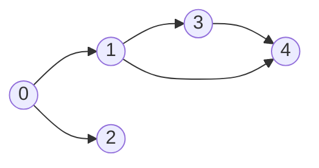
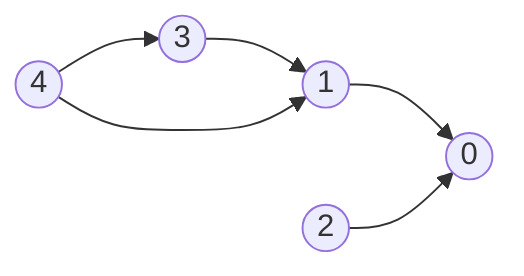
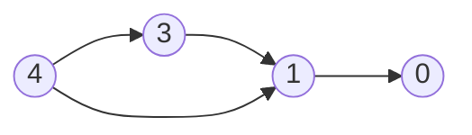
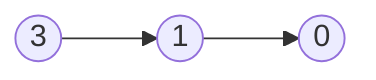
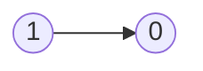
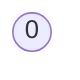

# Graphs

## 200. Number of Islands

=== "Python"

    ```python
    --8<-- "0200_number_of_islands.py"
    ```

=== "C++"

    ```cpp
    --8<-- "cpp/0200_number_of_islands.cc"
    ```

=== "TypeScript"

    ```typescript
    --8<-- "ts/0200_number_of_islands.ts"
    ```

## 695. Max Area of Island

=== "Python"

    ```python
    --8<-- "0695_max_area_of_island.py"
    ```

=== "C++"

    ```cpp
    --8<-- "cpp/0695_max_area_of_island.cc"
    ```

=== "TypeScript"

    ```typescript
    --8<-- "ts/0695_max_area_of_island.ts"
    ```

## 133. Clone Graph

=== "Python"

    ```python
    --8<-- "0133_clone_graph.py"
    ```

=== "C++"

    ```cpp
    --8<-- "cpp/0133_clone_graph.cc"
    ```

=== "TypeScript"

    ```typescript
    --8<-- "ts/0133_clone_graph.ts"
    ```

## 286. Walls and Gates

=== "Python"

    ```python
    --8<-- "0286_walls_and_gates.py"
    ```

=== "C++"

    ```cpp
    --8<-- "cpp/0286_walls_and_gates.cc"
    ```

=== "TypeScript"

    ```typescript
    --8<-- "ts/0286_walls_and_gates.ts"
    ```

## 994. Rotting Oranges

=== "Python"

    ```python
    --8<-- "0994_rotting_oranges.py"
    ```

=== "C++"

    ```cpp
    --8<-- "cpp/0994_rotting_oranges.cc"
    ```

=== "TypeScript"

    ```typescript
    --8<-- "ts/0994_rotting_oranges.ts"
    ```

## 417. Pacific Atlantic Water Flow

=== "Python"

    ```python
    --8<-- "0417_pacific_atlantic_water_flow.py"
    ```

=== "C++"

    ```cpp
    --8<-- "cpp/0417_pacific_atlantic_water_flow.cc"
    ```

=== "TypeScript"

    ```typescript
    --8<-- "ts/0417_pacific_atlantic_water_flow.ts"
    ```

## 130. Surrounded Regions

=== "Python"

    ```python
    --8<-- "0130_surrounded_regions.py"
    ```

=== "C++"

    ```cpp
    --8<-- "cpp/0130_surrounded_regions.cc"
    ```

=== "TypeScript"

    ```typescript
    --8<-- "ts/0130_surrounded_regions.ts"
    ```

## 207. Course Schedule

-   Return true if it is possible to finish all courses, otherwise return false.
-   Dependency relationships imply the topological sort algorithm.
-   Cycle detection






| course       | 0   | 0   | 1   | 1   | 3   |
| ------------ | --- | --- | --- | --- | --- |
| prerequisite | 1   | 2   | 3   | 4   | 4   |

| index     | 0   | 1   | 2   | 3   | 4   |
| --------- | --- | --- | --- | --- | --- |
| in-degree | 0   | 0   | 0   | 0   | 0   |

Initialize

-   graph

| prerequisite | 1     | 2     | 3     | 4        |
| ------------ | ----- | ----- | ----- | -------- |
| course       | `[0]` | `[0]` | `[1]` | `[1, 3]` |

-   in-degree

|           | 0   | 1   | 2   | 3   | 4   |
| --------- | --- | --- | --- | --- | --- |
| in-degree | 2   | 2   | 0   | 1   | 0   |

-   queue: `[2, 4]`

Pop `2` from the queue



|           | 0   | 1   | 2   | 3   | 4   |
| --------- | --- | --- | --- | --- | --- |
| in-degree | 1   | 2   | 0   | 1   | 0   |

-   queue: `[4]`

Pop `4` from the queue



|           | 0   | 1   | 2   | 3   | 4   |
| --------- | --- | --- | --- | --- | --- |
| in-degree | 1   | 1   | 0   | 0   | 0   |

-   queue: `[3]`

Pop `3` from the queue



|           | 0   | 1   | 2   | 3   | 4   |
| --------- | --- | --- | --- | --- | --- |
| in-degree | 1   | 0   | 0   | 0   | 0   |

-   queue: `[1]`

Pop `1` from the queue



|           | 0   | 1   | 2   | 3   | 4   |
| --------- | --- | --- | --- | --- | --- |
| in-degree | 0   | 0   | 0   | 0   | 0   |

-   queue: `[0]`

Pop `0` from the queue

=== "Python"

    ```python
    --8<-- "0207_course_schedule.py"
    ```

=== "C++"

    ```cpp
    --8<-- "cpp/0207_course_schedule.cc"
    ```

=== "TypeScript"

    ```typescript
    --8<-- "ts/0207_course_schedule.ts"
    ```

## 210. Course Schedule II

=== "Python"

    ```python
    --8<-- "0210_course_schedule_ii.py"
    ```

=== "C++"

    ```cpp
    --8<-- "cpp/0210_course_schedule_ii.cc"
    ```

=== "TypeScript"

    ```typescript
    --8<-- "ts/0210_course_schedule_ii.ts"
    ```

## 261. Graph Valid Tree

=== "Python"

    ```python
    --8<-- "0261_graph_valid_tree.py"
    ```

=== "C++"

    ```cpp
    --8<-- "cpp/0261_graph_valid_tree.cc"
    ```

=== "TypeScript"

    ```typescript
    --8<-- "ts/0261_graph_valid_tree.ts"
    ```

## 323. Number of Connected Components in an Undirected Graph

=== "Python"

    ```python
    --8<-- "0323_number_of_connected_components_in_an_undirected_graph.py"
    ```

=== "C++"

    ```cpp
    --8<-- "cpp/0323_number_of_connected_components_in_an_undirected_graph.cc"
    ```

=== "TypeScript"

    ```typescript
    --8<-- "ts/0323_number_of_connected_components_in_an_undirected_graph.ts"
    ```

## 684. Redundant Connection

=== "Python"

    ```python
    --8<-- "0684_redundant_connection.py"
    ```

=== "C++"

    ```cpp
    --8<-- "cpp/0684_redundant_connection.cc"
    ```

=== "TypeScript"

    ```typescript
    --8<-- "ts/0684_redundant_connection.ts"
    ```

## 127. Word Ladder

=== "Python"

    ```python
    --8<-- "0127_word_ladder.py"
    ```

=== "C++"

    ```cpp
    --8<-- "cpp/0127_word_ladder.cc"
    ```

=== "TypeScript"

    ```typescript
    --8<-- "ts/0127_word_ladder.ts"
    ```
