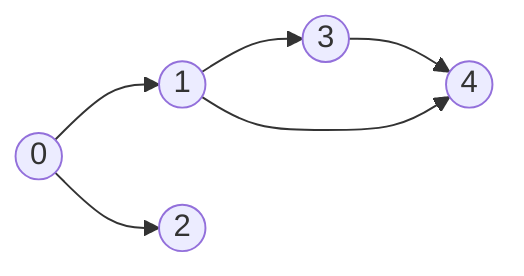
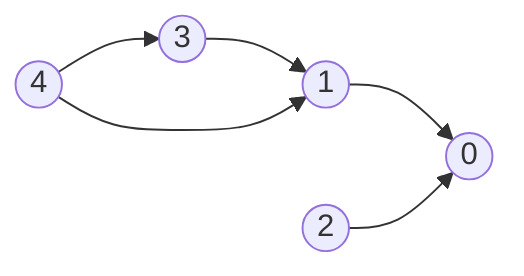
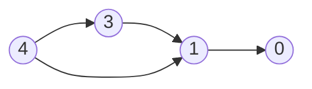
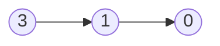
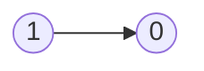
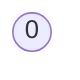

# Graphs

## 200. Number of Islands

-   [LeetCode](https://leetcode.com/problems/number-of-islands/) | [LeetCode CH](https://leetcode.cn/problems/number-of-islands/) (Medium)
-   Count the number of islands in a 2D grid.
-   Method 1: DFS
-   Method 2: BFS (use a queue to traverse the grid)

-   How to keep track of visited cells?

    1. Mark the visited cell as `0` (or any other value) to avoid revisiting it.
    2. Use a set to store the visited cells.

-   Steps:
    1. Init: variables
    2. DFS/BFS: starting from the cell with `1`, turn all the connected `1`s to `0`.
    3. Traverse the grid, and if the cell is `1`, increment the count and call DFS/BFS.


```python
--8<-- "0200_number_of_islands.py"
```

## 695. Max Area of Island

-   [LeetCode](https://leetcode.com/problems/max-area-of-island/) | [LeetCode CH](https://leetcode.cn/problems/max-area-of-island/) (Medium)

```python
--8<-- "0695_max_area_of_island.py"
```

## 133. Clone Graph

-   [LeetCode](https://leetcode.com/problems/clone-graph/) | [LeetCode CH](https://leetcode.cn/problems/clone-graph/) (Medium)

```python
--8<-- "0133_clone_graph.py"
```

## 286. Walls and Gates

-   [LeetCode](https://leetcode.com/problems/walls-and-gates/) | [LeetCode CH](https://leetcode.cn/problems/walls-and-gates/) (Medium)


```python
--8<-- "0286_walls_and_gates.py"
```

## 994. Rotting Oranges

-   [LeetCode](https://leetcode.com/problems/rotting-oranges/) | [LeetCode CH](https://leetcode.cn/problems/rotting-oranges/) (Medium)
-   Return the minimum number of minutes that must elapse until no cell has a fresh orange.
-   Hint: Multi-source BFS to count the level.


```python
--8<-- "0994_rotting_oranges.py"
```

## 417. Pacific Atlantic Water Flow

-   [LeetCode](https://leetcode.com/problems/pacific-atlantic-water-flow/) | [LeetCode CH](https://leetcode.cn/problems/pacific-atlantic-water-flow/) (Medium)

```python
--8<-- "0417_pacific_atlantic_water_flow.py"
```

## 130. Surrounded Regions

-   [LeetCode](https://leetcode.com/problems/surrounded-regions/) | [LeetCode CH](https://leetcode.cn/problems/surrounded-regions/) (Medium)

```python
--8<-- "0130_surrounded_regions.py"
```

## 207. Course Schedule

-   [LeetCode](https://leetcode.com/problems/course-schedule/) | [LeetCode CH](https://leetcode.cn/problems/course-schedule/) (Medium)
-   Return true if it is possible to finish all courses, otherwise return false.
-   Dependency relationships imply the topological sort algorithm.
-   Cycle detection
-   Topological Sort
    -   DAG (Directed Acyclic Graph)
    -   Time complexity: O(V+E)
    -   Space complexity: O(V+E)
    -   Prerequisites: Indegree (Look at the problem 1557. Minimum Number of Vertices to Reach All Nodes)
        -   Indegree: Number of incoming edges to a vertex
    -   Applications: task scheduling, course scheduling, build systems, dependency resolution, compiler optimization, etc.

{width=300px}

{width=300px}

Course to prerequisites mapping



Prerequisites to course mapping



| course       | 0   | 0   | 1   | 1   | 3   |
| ------------ | --- | --- | --- | --- | --- |
| prerequisite | 1   | 2   | 3   | 4   | 4   |

| index     | 0   | 1   | 2   | 3   | 4   |
| --------- | --- | --- | --- | --- | --- |
| in-degree | 0   | 0   | 0   | 0   | 0   |

Initialize

-   graph

| prerequisite | 1     | 2     | 3     | 4        |
| ------------ | ----- | ----- | ----- | -------- |
| course       | `[0]` | `[0]` | `[1]` | `[1, 3]` |

-   in-degree

|           | 0   | 1   | 2   | 3   | 4   |
| --------- | --- | --- | --- | --- | --- |
| in-degree | 2   | 2   | 0   | 1   | 0   |

-   queue: `[2, 4]`
-   pop `2` from the queue



|           | 0   | 1   | 2   | 3   | 4   |
| --------- | --- | --- | --- | --- | --- |
| in-degree | 1   | 2   | 0   | 1   | 0   |

-   queue: `[4]`
-   pop `4` from the queue



|           | 0   | 1   | 2   | 3   | 4   |
| --------- | --- | --- | --- | --- | --- |
| in-degree | 1   | 1   | 0   | 0   | 0   |

-   queue: `[3]`
-   pop `3` from the queue



|           | 0   | 1   | 2   | 3   | 4   |
| --------- | --- | --- | --- | --- | --- |
| in-degree | 1   | 0   | 0   | 0   | 0   |

-   queue: `[1]`
-   pop `1` from the queue



|           | 0   | 1   | 2   | 3   | 4   |
| --------- | --- | --- | --- | --- | --- |
| in-degree | 0   | 0   | 0   | 0   | 0   |

-   queue: `[0]`
-   pop `0` from the queue
-   All courses are taken. Return `True`.

```python
--8<-- "0207_course_schedule.py"
```

## 210. Course Schedule II

-   [LeetCode](https://leetcode.com/problems/course-schedule-ii/) | [LeetCode CH](https://leetcode.cn/problems/course-schedule-ii/) (Medium)
-   Return the ordering of courses you should take to finish all courses. If there are multiple valid answers, return any of them.

{width=300px}

```python
--8<-- "0210_course_schedule_ii.py"
```

## 261. Graph Valid Tree

-   [LeetCode](https://leetcode.com/problems/graph-valid-tree/) | [LeetCode CH](https://leetcode.cn/problems/graph-valid-tree/) (Medium)

```python
--8<-- "0261_graph_valid_tree.py"
```

## 323. Number of Connected Components in an Undirected Graph

-   [LeetCode](https://leetcode.com/problems/number-of-connected-components-in-an-undirected-graph/) | [LeetCode CH](https://leetcode.cn/problems/number-of-connected-components-in-an-undirected-graph/) (Medium)

```python
--8<-- "0323_number_of_connected_components_in_an_undirected_graph.py"
```

## 684. Redundant Connection

-   [LeetCode](https://leetcode.com/problems/redundant-connection/) | [LeetCode CH](https://leetcode.cn/problems/redundant-connection/) (Medium)

```python
--8<-- "0684_redundant_connection.py"
```

## 127. Word Ladder

-   [LeetCode](https://leetcode.com/problems/word-ladder/) | [LeetCode CH](https://leetcode.cn/problems/word-ladder/) (Hard)

```python
--8<-- "0127_word_ladder.py"
```
