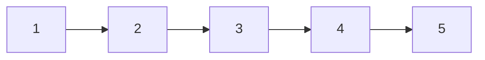
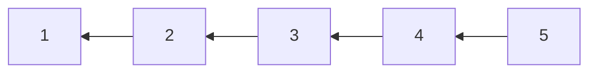
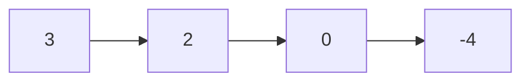
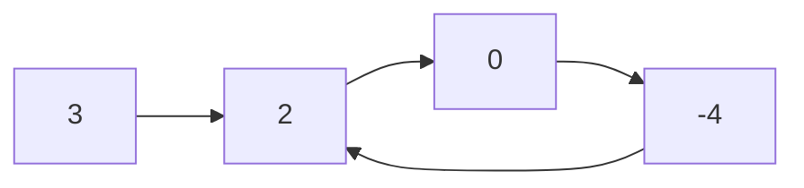

# Linked List

## 206. Reverse Linked List

-   [LeetCode](https://leetcode.com/problems/reverse-linked-list/) | [LeetCode CH](https://leetcode.cn/problems/reverse-linked-list/) (Easy)
-   Tags: linked list, recursion
-   Reverse a singly linked list.





```python
--8<-- "0206_reverse_linked_list.py"
```

## 21. Merge Two Sorted Lists

-   [LeetCode](https://leetcode.com/problems/merge-two-sorted-lists/) | [LeetCode CH](https://leetcode.cn/problems/merge-two-sorted-lists/) (Easy)
-   Tags: linked list, recursion
-   Merge the two lists into one sorted list.

<iframe width="560" height="315" src="https://www.youtube.com/embed/XIdigk956u0?si=2cVoU6DujA3Mgtlr" title="YouTube video player" frameborder="0" allow="accelerometer; autoplay; clipboard-write; encrypted-media; gyroscope; picture-in-picture; web-share" referrerpolicy="strict-origin-when-cross-origin" allowfullscreen></iframe>

```python
--8<-- "0021_merge_two_sorted_lists.py"
```

## 143. Reorder List

-   [LeetCode](https://leetcode.com/problems/reorder-list/) | [LeetCode CH](https://leetcode.cn/problems/reorder-list/) (Medium)
-   Tags: linked list, two pointers, stack, recursion

```python
--8<-- "0143_reorder_list.py"
```

## 19. Remove Nth Node From End of List

-   [LeetCode](https://leetcode.com/problems/remove-nth-node-from-end-of-list/) | [LeetCode CH](https://leetcode.cn/problems/remove-nth-node-from-end-of-list/) (Medium)
-   Tags: linked list, two pointers
-   Given the `head` of a linked list, remove the `n-th` node from the end of the list and return its head.

```python
--8<-- "0019_remove_nth_node_from_end_of_list.py"
```

## 138. Copy List with Random Pointer

-   [LeetCode](https://leetcode.com/problems/copy-list-with-random-pointer/) | [LeetCode CH](https://leetcode.cn/problems/copy-list-with-random-pointer/) (Medium)
-   Tags: hash table, linked list

```python
--8<-- "0138_copy_list_with_random_pointer.py"
```

## 2. Add Two Numbers

-   [LeetCode](https://leetcode.com/problems/add-two-numbers/) | [LeetCode CH](https://leetcode.cn/problems/add-two-numbers/) (Medium)
-   Tags: linked list, math, recursion
-   Represent the sum of two numbers as a linked list.

```python
--8<-- "0002_add_two_numbers.py"
```

## 141. Linked List Cycle

-   [LeetCode](https://leetcode.com/problems/linked-list-cycle/) | [LeetCode CH](https://leetcode.cn/problems/linked-list-cycle/) (Easy)
-   Tags: hash table, linked list, two pointers
-   Determine if a linked list has a cycle in it.





```python
--8<-- "0141_linked_list_cycle.py"
```

## 287. Find the Duplicate Number

-   [LeetCode](https://leetcode.com/problems/find-the-duplicate-number/) | [LeetCode CH](https://leetcode.cn/problems/find-the-duplicate-number/) (Medium)
-   Tags: array, two pointers, binary search, bit manipulation
-   Find the duplicate number in an array containing `n + 1` integers where each integer is between `1` and `n` inclusive.

```python
--8<-- "0287_find_the_duplicate_number.py"
```

## 146. LRU Cache

-   [LeetCode](https://leetcode.com/problems/lru-cache/) | [LeetCode CH](https://leetcode.cn/problems/lru-cache/) (Medium)
-   Tags: hash table, linked list, design, doubly linked list
-   Design and implement a data structure for **Least Recently Used (LRU) cache**. It should support the following operations: get and put.


| Data structure     | Description                   |
| ------------------ | ----------------------------- |
| Doubly Linked List | To store the key-value pairs. |
| Hash Map           | To store the key-node pairs.  |

<iframe width="560" height="315" src="https://www.youtube.com/embed/7ABFKPK2hD4?si=Ys47opcHraHHWtOI" title="YouTube video player" frameborder="0" allow="accelerometer; autoplay; clipboard-write; encrypted-media; gyroscope; picture-in-picture; web-share" referrerpolicy="strict-origin-when-cross-origin" allowfullscreen></iframe>

| Approach | Time Complexity | Space Complexity |
| -------- | --------------- | ---------------- |
| LRU      | O(1)            | O(n)             |

```python
--8<-- "0146_lru_cache.py"
```

## 23. Merge k Sorted Lists

-   [LeetCode](https://leetcode.com/problems/merge-k-sorted-lists/) | [LeetCode CH](https://leetcode.cn/problems/merge-k-sorted-lists/) (Hard)
-   Tags: linked list, divide and conquer, heap priority queue, merge sort
-   Prerequisite: 21. Merge Two Sorted Lists

<iframe width="560" height="315" src="https://www.youtube.com/embed/q5a5OiGbT6Q?si=SlQg9SKZh1YL62vH" title="YouTube video player" frameborder="0" allow="accelerometer; autoplay; clipboard-write; encrypted-media; gyroscope; picture-in-picture; web-share" referrerpolicy="strict-origin-when-cross-origin" allowfullscreen></iframe>

```python
--8<-- "0023_merge_k_sorted_lists.py"
```

## 25. Reverse Nodes in k-Group

-   [LeetCode](https://leetcode.com/problems/reverse-nodes-in-k-group/) | [LeetCode CH](https://leetcode.cn/problems/reverse-nodes-in-k-group/) (Hard)
-   Tags: linked list, recursion

```python
--8<-- "0025_reverse_nodes_in_k_group.py"
```
