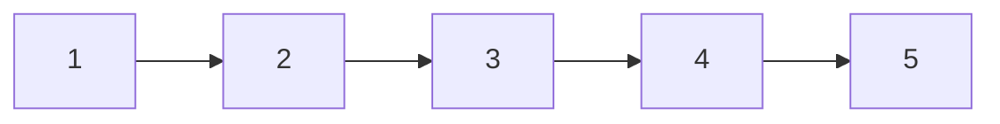
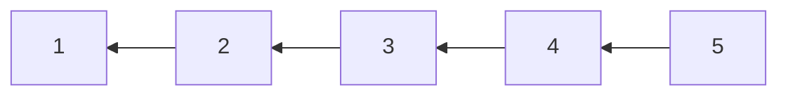
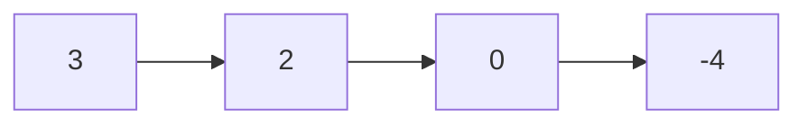
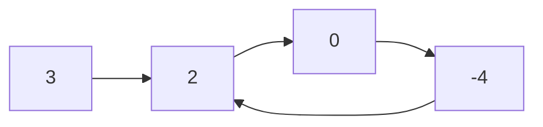

# Linked List

## 206. Reverse Linked List

-   Reverse a singly linked list.





=== "Python"

    ```python
    --8<-- "0206_reverse_linked_list.py"
    ```

=== "C++"

    ```cpp
    --8<-- "cpp/0206_reverse_linked_list.cc"
    ```

=== "TypeScript"

    ```typescript
    --8<-- "ts/0206_reverse_linked_list.ts"
    ```

## 21. Merge Two Sorted Lists

=== "Python"

    ```python
    --8<-- "0021_merge_two_sorted_lists.py"
    ```

=== "C++"

    ```cpp
    --8<-- "cpp/0021_merge_two_sorted_lists.cc"
    ```

=== "TypeScript"

    ```typescript
    --8<-- "ts/0021_merge_two_sorted_lists.ts"
    ```

## 143. Reorder List

=== "Python"

    ```python
    --8<-- "0143_reorder_list.py"
    ```

=== "C++"

    ```cpp
    --8<-- "cpp/0143_reorder_list.cc"
    ```

=== "TypeScript"

    ```typescript
    --8<-- "ts/0143_reorder_list.ts"
    ```

## 19. Remove Nth Node From End of List

-   Given the `head` of a linked list, remove the `n-th` node from the end of the list and return its head.

=== "Python"

    ```python
    --8<-- "0019_remove_nth_node_from_end_of_list.py"
    ```

=== "C++"

    ```cpp
    --8<-- "cpp/0019_remove_nth_node_from_end_of_list.cc"
    ```

=== "TypeScript"

    ```typescript
    --8<-- "ts/0019_remove_nth_node_from_end_of_list.ts"
    ```

## 138. Copy List With Random Pointer

=== "Python"

    ```python
    --8<-- "0138_copy_list_with_random_pointer.py"
    ```

=== "C++"

    ```cpp
    --8<-- "cpp/0138_copy_list_with_random_pointer.cc"
    ```

=== "TypeScript"

    ```typescript
    --8<-- "ts/0138_copy_list_with_random_pointer.ts"
    ```

## 2. Add Two Numbers

-   Represent the sum of two numbers as a linked list.

=== "Python"

    ```python
    --8<-- "0002_add_two_numbers.py"
    ```

=== "C++"

    ```cpp
    --8<-- "cpp/0002_add_two_numbers.cc"
    ```

=== "TypeScript"

    ```typescript
    --8<-- "ts/0002_add_two_numbers.ts"
    ```

## 141. Linked List Cycle

-   Determine if a linked list has a cycle in it.





=== "Python"

    ```python
    --8<-- "0141_linked_list_cycle.py"
    ```

=== "C++"

    ```cpp
    --8<-- "cpp/0141_linked_list_cycle.cc"
    ```

=== "TypeScript"

    ```typescript
    --8<-- "ts/0141_linked_list_cycle.ts"
    ```

## 287. Find the Duplicate Number

-   Find the duplicate number in an array containing `n + 1` integers where each integer is between `1` and `n` inclusive.

=== "Python"

    ```python
    --8<-- "0287_find_the_duplicate_number.py"
    ```

=== "C++"

    ```cpp
    --8<-- "cpp/0287_find_the_duplicate_number.cc"
    ```

=== "TypeScript"

    ```typescript
    --8<-- "ts/0287_find_the_duplicate_number.ts"
    ```

## 146. LRU Cache

-   Design and implement a data structure for **Least Recently Used (LRU) cache**. It should support the following operations: get and put.

{width=300px}

-   Data structure
    -   Doubly Linked List: to store the key-value pairs.
    -   Hash Map: to store the key-node pairs.

=== "Python"

    ```python
    --8<-- "0146_lru_cache.py"
    ```

=== "C++"

    ```cpp
    --8<-- "cpp/0146_lru_cache.cc"
    ```

=== "TypeScript"

    ```typescript
    --8<-- "ts/0146_lru_cache.ts"
    ```

## 23. Merge K Sorted Lists

=== "Python"

    ```python
    --8<-- "0023_merge_k_sorted_lists.py"
    ```

=== "C++"

    ```cpp
    --8<-- "cpp/0023_merge_k_sorted_lists.cc"
    ```

=== "TypeScript"

    ```typescript
    --8<-- "ts/0023_merge_k_sorted_lists.ts"
    ```
