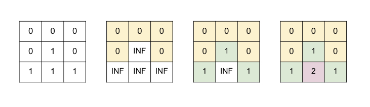

# BFS

## LeetCode Problems

1. 1926 - [Nearest Exit from Entrance in Maze](https://leetcode.com/problems/nearest-exit-from-entrance-in-maze/) (Medium)
2. 0934 - [Shortest Bridge](https://leetcode.com/problems/shortest-bridge/) (Medium)
3. 0433 - [Minimum Genetic Mutation](https://leetcode.com/problems/minimum-genetic-mutation/) (Medium)
4. 0127 - [Word Ladder](https://leetcode.com/problems/word-ladder/) (Medium)
5. 1306 - [Jump Game III](https://leetcode.com/problems/jump-game-iii/) (Medium)
6. 0542 - [01 Matrix](https://leetcode.com/problems/01-matrix/) (Medium)
7. 1091 - [Shortest Path in Binary Matrix](https://leetcode.com/problems/shortest-path-in-binary-matrix/) (Medium)
8. 0863 - [All Nodes Distance K in Binary Tree](https://leetcode.com/problems/all-nodes-distance-k-in-binary-tree/) (Medium)
9. 0864 - [Shortest Path to Get All Keys](https://leetcode.com/problems/shortest-path-to-get-all-keys/) (Hard)

## 1926. Nearest Exit from Entrance in Maze

```python
--8<-- "1926_nearest_exit_from_entrance_in_maze.py"
```

## 934. Shortest Bridge

```python
--8<-- "0934_shortest_bridge.py"
```

## 433. Minimum Genetic Mutation

```python
--8<-- "0433_minimum_genetic_mutation.py"
```

## 127. Word Ladder

```python
--8<-- "0127_word_ladder.py"
```

## 1306. Jump Game III

- Return `True` if you can reach the end of the array starting at index `start` and `False` otherwise.

```python
--8<-- "1306_jump_game_iii.py"
```

## 542. 01 Matrix

- Return the distance of the nearest 0 for each cell in the matrix.



```python
--8<-- "0542_01_matrix.py"
```

## 1091. Shortest Path in Binary Matrix

```python
--8<-- "1091_shortest_path_in_binary_matrix.py"
```

## 863. All Nodes Distance K in Binary Tree

```python
--8<-- "0863_all_nodes_distance_k_in_binary_tree.py"
```

## 864. Shortest Path to Get All Keys

```python
--8<-- "0864_shortest_path_to_get_all_keys.py"
```
