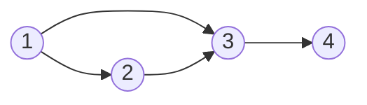
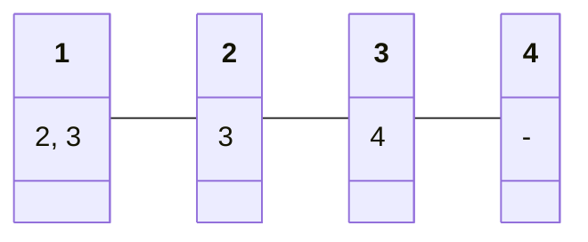

# Graph

## Resources

-   [Graph Editor](https://csacademy.com/app/graph_editor/): Create and visualize graphs.
-   [【题单】图论算法（DFS/BFS/拓扑排序/最短路/最小生成树/二分图/基环树/欧拉路径）](https://leetcode.cn/circle/discuss/01LUak/)

## Concepts

-   Graph
-   Vertex (Node)
-   Edge
-   Weight

### Types

-   **Undirected graph**: A graph in which edges have no direction.


-   **Directed graph**: A graph in which edges have direction.


-   **Cyclic graph**: A graph in which there is a cycle. A cycle is a path of edges that starts and ends at the same vertex, e.g., `1 -> 3 -> 4 -> 1`.


-   **Acyclic graph**: A graph in which there is no cycle.


-   **Directed Acyclic Graph** (DAG): A directed graph with no cycles.
    -   Topological sort


-   **Weighted graph**: A graph in which edges have weights.


-   **Connected Graph**: A graph in which there is a path between every pair of vertices.


-   **Disconnected Graph**: A graph in which there is no path between some pairs of vertices.


-   **Eulerian path**: A path that visits every edge exactly once, e.g., `5 -> 4 -> 1 -> 2 -> 3`.


### Representation

1. Adjacency Matrix
2. Adjacency List



Adjacency Matrix

|            | Node 1 | Node 2 | Node 3 | Node 4 |
| :--------: | :----: | :----: | :----: | :----: |
| **Node 1** |   0    |   1    |   1    |   0    |
| **Node 2** |   0    |   0    |   1    |   0    |
| **Node 3** |   0    |   0    |   0    |   1    |
| **Node 4** |   0    |   0    |   0    |   0    |

```python
grid = [
    [0, 1, 1, 0],
    [0, 0, 1, 0],
    [0, 0, 0, 1],
    [0, 0, 0, 0]
]
```

Adjacency List



```python
graph = {
    1: [2, 3],
    2: [3],
    3: [4],
    4: []
}
```

### Degree

1. Degree: Number of edges connected to a node
2. In-degree: Number of edges coming into a node
3. Out-degree: Number of edges going out of a node


-   In-degree of Node 1: 0
-   Out-degree of Node 1: 2
-   In-degree of Node 2: 1
-   Out-degree of Node 2: 1

```python
# List
in_degree = [0, 1, 2, 1]
out_degree = [2, 1, 1, 0]

# Dict
in_degree = {1: 0, 2: 1, 3: 2, 4: 1}
out_degree = {1: 2, 2: 1, 3: 1, 4: 0}
```
