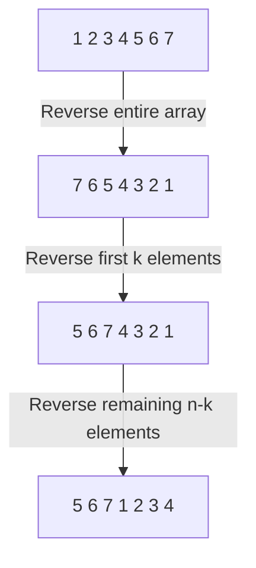

# Arrays

- [x] [53. Maximum Subarray](https://leetcode.cn/problems/maximum-subarray/) (Medium)
- [x] [56. Merge Intervals](https://leetcode.cn/problems/merge-intervals/) (Medium)
- [x] [189. Rotate Array](https://leetcode.cn/problems/rotate-array/) (Medium)
- [x] [238. Product of Array Except Self](https://leetcode.cn/problems/product-of-array-except-self/) (Medium)
- [ ] [41. First Missing Positive](https://leetcode.cn/problems/first-missing-positive/) (Hard)

## 53. Maximum Subarray

-   [LeetCode](https://leetcode.com/problems/maximum-subarray/) | [LeetCode CH](https://leetcode.cn/problems/maximum-subarray/) (Medium)

-   Tags: array, divide and conquer, dynamic programming

```python title="53. Maximum Subarray - Python Solution"
from typing import List


# DP Kadane
def maxSubArrayDP(nums: List[int]) -> int:
    dp = [0 for _ in range(len(nums))]

    dp[0] = nums[0]
    maxSum = nums[0]

    for i in range(1, len(nums)):
        dp[i] = max(
            dp[i - 1] + nums[i],  # continue the previous subarray
            nums[i],  # start a new subarray
        )
        maxSum = max(maxSum, dp[i])

    return maxSum


# Greedy
def maxSubArrayGreedy(nums: List[int]) -> int:
    max_sum = nums[0]
    cur_sum = 0

    for num in nums:
        cur_sum = max(cur_sum + num, num)
        max_sum = max(max_sum, cur_sum)

    return max_sum


# Prefix Sum
def maxSubArrayPrefixSum(nums: List[int]) -> int:
    prefix_sum = 0
    prefix_sum_min = 0
    res = float("-inf")

    for num in nums:
        prefix_sum += num
        res = max(res, prefix_sum - prefix_sum_min)
        prefix_sum_min = min(prefix_sum_min, prefix_sum)

    return res


nums = [-2, 1, -3, 4, -1, 2, 1, -5, 4]
print(maxSubArrayDP(nums))  # 6
print(maxSubArrayGreedy(nums))  # 6
print(maxSubArrayPrefixSum(nums))  # 6

```

## 56. Merge Intervals

-   [LeetCode](https://leetcode.com/problems/merge-intervals/) | [LeetCode CH](https://leetcode.cn/problems/merge-intervals/) (Medium)

-   Tags: array, sorting
-   Merge all overlapping intervals.

<iframe width="560" height="315" src="https://www.youtube.com/embed/44H3cEC2fFM?si=J-Jr_Fg2eDse3-de" title="YouTube video player" frameborder="0" allow="accelerometer; autoplay; clipboard-write; encrypted-media; gyroscope; picture-in-picture; web-share" referrerpolicy="strict-origin-when-cross-origin" allowfullscreen></iframe>

```python title="56. Merge Intervals - Python Solution"
from typing import List


# Intervals
def merge(intervals: List[List[int]]) -> List[List[int]]:
    n = len(intervals)
    if n <= 1:
        return intervals

    intervals.sort(key=lambda x: x[0])
    res = [intervals[0]]

    for i in range(1, n):
        if intervals[i][0] <= res[-1][1]:
            res[-1][1] = max(res[-1][1], intervals[i][1])
        else:
            res.append(intervals[i])

    return res


print(merge([[1, 3], [2, 6], [8, 10], [15, 18]]))
# [[1, 6], [8, 10], [15, 18]]

```

```cpp title="56. Merge Intervals - C++ Solution"
#include <algorithm>
#include <iostream>
#include <vector>
using namespace std;

// Interval
vector<vector<int>> merge(vector<vector<int>>& intervals) {
    sort(intervals.begin(), intervals.end());
    vector<vector<int>> res;

    for (auto& range : intervals) {
        if (!res.empty() && range[0] <= res.back()[1]) {
            res.back()[1] = max(res.back()[1], range[1]);
        } else {
            res.emplace_back(range);
        }
    }
    return res;
}

int main() {
    vector<vector<int>> intervals = {{1, 3}, {2, 6}, {8, 10}, {15, 18}};
    vector<vector<int>> res = merge(intervals);
    for (auto& range : res) {
        cout << range[0] << ", " << range[1] << endl;
    }
    return 0;
}

```

## 189. Rotate Array

-   [LeetCode](https://leetcode.com/problems/rotate-array/) | [LeetCode CH](https://leetcode.cn/problems/rotate-array/) (Medium)

-   Tags: array, math, two pointers
- Rotate array with reversing subarrays



```python title="189. Rotate Array - Python Solution"
from typing import List


# Array
def rotate(nums: List[int], k: int) -> None:
    """
    Do not return anything, modify nums in-place instead.
    """

    def reverse(i: int, j: int) -> None:
        while i < j:
            nums[i], nums[j] = nums[j], nums[i]
            i += 1
            j -= 1

    n = len(nums)
    k %= n
    reverse(0, n - 1)
    reverse(0, k - 1)
    reverse(k, n - 1)


nums = [1, 2, 3, 4, 5, 6, 7]
k = 3
rotate(nums, k)
print(nums)  # [5, 6, 7, 1, 2, 3, 4]

```

```cpp title="189. Rotate Array - C++ Solution"
#include <algorithm>
#include <iostream>
#include <vector>
using namespace std;

// Array
void rotate(vector<int>& nums, int k) {
    k %= nums.size();

    reverse(nums.begin(), nums.end());
    reverse(nums.begin(), nums.begin() + k);
    reverse(nums.begin() + k, nums.end());
}

int main() {
    vector<int> nums = {1, 2, 3, 4, 5, 6, 7};
    int k = 3;
    rotate(nums, k);
    // [5, 6, 7, 1, 2, 3, 4]
    for (const auto& num : nums) {
        cout << num << " ";
    }
    cout << endl;
    return 0;
}

```

## 238. Product of Array Except Self

-   [LeetCode](https://leetcode.com/problems/product-of-array-except-self/) | [LeetCode CH](https://leetcode.cn/problems/product-of-array-except-self/) (Medium)

-   Tags: array, prefix sum
-   Classic **Prefix Sum** problem
-   Return an array `output` such that `output[i]` is equal to the product of all the elements of `nums` except `nums[i]`.

| Approach           | Time | Space |
| ------------------ | ---- | ----- |
| Prefix             | O(n) | O(n)  |
| Prefix (Optimized) | O(n) | O(1)  |

```python title="238. Product of Array Except Self - Python Solution"
from typing import List


# Prefix
def productExceptSelf(nums: List[int]) -> List[int]:
    n = len(nums)
    prefix = [1 for _ in range(n)]
    suffix = [1 for _ in range(n)]

    for i in range(1, n):
        prefix[i] = nums[i - 1] * prefix[i - 1]

    for i in range(n - 2, -1, -1):
        suffix[i] = nums[i + 1] * suffix[i + 1]

    result = [i * j for i, j in zip(prefix, suffix)]

    return result


# Prefix (Optimized)
def productExceptSelfOptimized(nums: List[int]) -> List[int]:
    n = len(nums)
    result = [1 for _ in range(n)]

    prefix = 1
    for i in range(n):
        result[i] = prefix
        prefix *= nums[i]

    suffix = 1
    for i in range(n - 1, -1, -1):
        result[i] *= suffix
        suffix *= nums[i]

    return result


print(productExceptSelf([1, 2, 3, 4]))
# [24, 12, 8, 6]
print(productExceptSelfOptimized([1, 2, 3, 4]))
# [24, 12, 8, 6]

```

```cpp title="238. Product of Array Except Self - C++ Solution"
#include <vector>
#include <iostream>
using namespace std;

// Prefix Sum
class Solution
{
public:
    vector<int> productExceptSelf(vector<int> &nums)
    {
        int n = nums.size();
        vector<int> prefix(n, 1);
        vector<int> suffix(n, 1);
        vector<int> res(n, 1);

        for (int i = 1; i < n; i++)
        {
            prefix[i] = prefix[i - 1] * nums[i - 1];
        }

        for (int i = n - 2; i >= 0; i--)
        {
            suffix[i] = suffix[i + 1] * nums[i + 1];
        }

        for (int i = 0; i < n; i++)
        {
            res[i] = prefix[i] * suffix[i];
        }
        return res;
    }
};

int main()
{
    vector<int> nums = {1, 2, 3, 4};
    Solution obj;
    vector<int> result = obj.productExceptSelf(nums);

    for (int i = 0; i < result.size(); i++)
    {
        cout << result[i] << "\n";
    }
    cout << endl;
    // 24, 12, 8, 6
    return 0;
}

```

## 41. First Missing Positive

-   [LeetCode](https://leetcode.com/problems/first-missing-positive/) | [LeetCode CH](https://leetcode.cn/problems/first-missing-positive/) (Hard)

-   Tags: array, hash table
