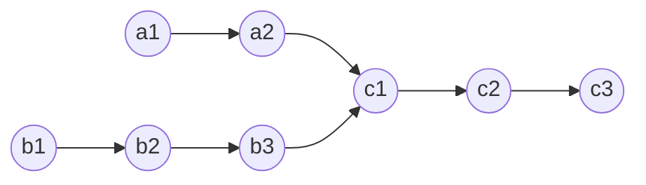
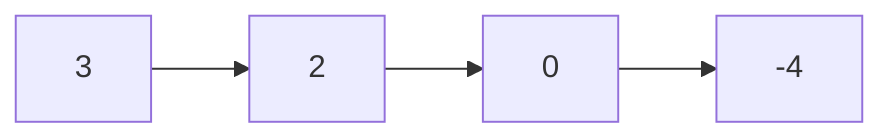
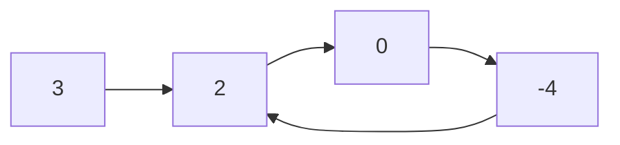

# Linked List

- [x] [160. Intersection of Two Linked Lists](https://leetcode.cn/problems/intersection-of-two-linked-lists/) (Easy)
- [x] [206. Reverse Linked List](https://leetcode.cn/problems/reverse-linked-list/) (Easy)
- [x] [234. Palindrome Linked List](https://leetcode.cn/problems/palindrome-linked-list/) (Easy)
- [x] [141. Linked List Cycle](https://leetcode.cn/problems/linked-list-cycle/) (Easy)
- [x] [142. Linked List Cycle II](https://leetcode.cn/problems/linked-list-cycle-ii/) (Medium)
- [x] [21. Merge Two Sorted Lists](https://leetcode.cn/problems/merge-two-sorted-lists/) (Easy)
- [x] [2. Add Two Numbers](https://leetcode.cn/problems/add-two-numbers/) (Medium)
- [x] [19. Remove Nth Node From End of List](https://leetcode.cn/problems/remove-nth-node-from-end-of-list/) (Medium)
- [x] [24. Swap Nodes in Pairs](https://leetcode.cn/problems/swap-nodes-in-pairs/) (Medium)
- [ ] [25. Reverse Nodes in k-Group](https://leetcode.cn/problems/reverse-nodes-in-k-group/) (Hard)
- [x] [138. Copy List with Random Pointer](https://leetcode.cn/problems/copy-list-with-random-pointer/) (Medium)
- [ ] [148. Sort List](https://leetcode.cn/problems/sort-list/) (Medium)
- [x] [23. Merge k Sorted Lists](https://leetcode.cn/problems/merge-k-sorted-lists/) (Hard)
- [x] [146. LRU Cache](https://leetcode.cn/problems/lru-cache/) (Medium)

## 160. Intersection of Two Linked Lists

-   [LeetCode](https://leetcode.com/problems/intersection-of-two-linked-lists/) | [LeetCode CH](https://leetcode.cn/problems/intersection-of-two-linked-lists/) (Easy)

-   Tags: hash table, linked list, two pointers
-   Find the node at which the intersection of two singly linked lists begins.



```python title="160. Intersection of Two Linked Lists - Python Solution"
--8<-- "0160_intersection_of_two_linked_lists.py"
```

## 206. Reverse Linked List

-   [LeetCode](https://leetcode.com/problems/reverse-linked-list/) | [LeetCode CH](https://leetcode.cn/problems/reverse-linked-list/) (Easy)

-   Tags: linked list, recursion
-   Reverse a singly linked list.


```python title="206. Reverse Linked List - Python Solution"
--8<-- "0206_reverse_linked_list.py"
```

## 234. Palindrome Linked List

-   [LeetCode](https://leetcode.com/problems/palindrome-linked-list/) | [LeetCode CH](https://leetcode.cn/problems/palindrome-linked-list/) (Easy)

-   Tags: linked list, two pointers, stack, recursion

```python title="234. Palindrome Linked List - Python Solution"
--8<-- "0234_palindrome_linked_list.py"
```

## 141. Linked List Cycle

-   [LeetCode](https://leetcode.com/problems/linked-list-cycle/) | [LeetCode CH](https://leetcode.cn/problems/linked-list-cycle/) (Easy)

-   Tags: hash table, linked list, two pointers
-   Determine if a linked list has a cycle in it.





```python title="141. Linked List Cycle - Python Solution"
--8<-- "0141_linked_list_cycle.py"
```

```cpp title="141. Linked List Cycle - C++ Solution"
--8<-- "cpp/0141_linked_list_cycle.cc"
```

## 142. Linked List Cycle II

-   [LeetCode](https://leetcode.com/problems/linked-list-cycle-ii/) | [LeetCode CH](https://leetcode.cn/problems/linked-list-cycle-ii/) (Medium)

-   Tags: hash table, linked list, two pointers
-   Given a linked list, return the node where the cycle begins. If there is no cycle, return `None`.


```python title="142. Linked List Cycle II - Python Solution"
--8<-- "0142_linked_list_cycle_ii.py"
```

```cpp title="142. Linked List Cycle II - C++ Solution"
--8<-- "cpp/0142_linked_list_cycle_ii.cc"
```

## 21. Merge Two Sorted Lists

-   [LeetCode](https://leetcode.com/problems/merge-two-sorted-lists/) | [LeetCode CH](https://leetcode.cn/problems/merge-two-sorted-lists/) (Easy)

-   Tags: linked list, recursion
-   Merge the two lists into one sorted list.

<iframe width="560" height="315" src="https://www.youtube.com/embed/XIdigk956u0?si=2cVoU6DujA3Mgtlr" title="YouTube video player" frameborder="0" allow="accelerometer; autoplay; clipboard-write; encrypted-media; gyroscope; picture-in-picture; web-share" referrerpolicy="strict-origin-when-cross-origin" allowfullscreen></iframe>

```python title="21. Merge Two Sorted Lists - Python Solution"
--8<-- "0021_merge_two_sorted_lists.py"
```

## 2. Add Two Numbers

-   [LeetCode](https://leetcode.com/problems/add-two-numbers/) | [LeetCode CH](https://leetcode.cn/problems/add-two-numbers/) (Medium)

-   Tags: linked list, math, recursion
-   Represent the sum of two numbers as a linked list.

```python title="2. Add Two Numbers - Python Solution"
--8<-- "0002_add_two_numbers.py"
```

## 19. Remove Nth Node From End of List

-   [LeetCode](https://leetcode.com/problems/remove-nth-node-from-end-of-list/) | [LeetCode CH](https://leetcode.cn/problems/remove-nth-node-from-end-of-list/) (Medium)

-   Tags: linked list, two pointers
-   Given the `head` of a linked list, remove the `n-th` node from the end of the list and return its head.

```python title="19. Remove Nth Node From End of List - Python Solution"
--8<-- "0019_remove_nth_node_from_end_of_list.py"
```

## 24. Swap Nodes in Pairs

-   [LeetCode](https://leetcode.com/problems/swap-nodes-in-pairs/) | [LeetCode CH](https://leetcode.cn/problems/swap-nodes-in-pairs/) (Medium)

-   Tags: linked list, recursion
-   Given a linked list, swap every two adjacent nodes and return its head.

```python title="24. Swap Nodes in Pairs - Python Solution"
--8<-- "0024_swap_nodes_in_pairs.py"
```

## 25. Reverse Nodes in k-Group

-   [LeetCode](https://leetcode.com/problems/reverse-nodes-in-k-group/) | [LeetCode CH](https://leetcode.cn/problems/reverse-nodes-in-k-group/) (Hard)

-   Tags: linked list, recursion

## 138. Copy List with Random Pointer

-   [LeetCode](https://leetcode.com/problems/copy-list-with-random-pointer/) | [LeetCode CH](https://leetcode.cn/problems/copy-list-with-random-pointer/) (Medium)

-   Tags: hash table, linked list

```python title="138. Copy List with Random Pointer - Python Solution"
--8<-- "0138_copy_list_with_random_pointer.py"
```

## 148. Sort List

-   [LeetCode](https://leetcode.com/problems/sort-list/) | [LeetCode CH](https://leetcode.cn/problems/sort-list/) (Medium)

-   Tags: linked list, two pointers, divide and conquer, sorting, merge sort

## 23. Merge k Sorted Lists

-   [LeetCode](https://leetcode.com/problems/merge-k-sorted-lists/) | [LeetCode CH](https://leetcode.cn/problems/merge-k-sorted-lists/) (Hard)

-   Tags: linked list, divide and conquer, heap priority queue, merge sort
-   Prerequisite: 21. Merge Two Sorted Lists

<iframe width="560" height="315" src="https://www.youtube.com/embed/q5a5OiGbT6Q?si=SlQg9SKZh1YL62vH" title="YouTube video player" frameborder="0" allow="accelerometer; autoplay; clipboard-write; encrypted-media; gyroscope; picture-in-picture; web-share" referrerpolicy="strict-origin-when-cross-origin" allowfullscreen></iframe>

```python title="23. Merge k Sorted Lists - Python Solution"
--8<-- "0023_merge_k_sorted_lists.py"
```

## 146. LRU Cache

-   [LeetCode](https://leetcode.com/problems/lru-cache/) | [LeetCode CH](https://leetcode.cn/problems/lru-cache/) (Medium)

-   Tags: hash table, linked list, design, doubly linked list
- Design and implement a data structure for **Least Recently Used (LRU) cache**. It should support the following operations: get and put.
- [lru](https://media.geeksforgeeks.org/wp-content/uploads/20240909142802/Working-of-LRU-Cache-copy-2.webp)
- 

| Data structure     | Description                   |
| ------------------ | ----------------------------- |
| Doubly Linked List | To store the key-value pairs. |
| Hash Map           | To store the key-node pairs.  |

```python title="146. LRU Cache - Python Solution"
--8<-- "0146_lru_cache.py"
```

```cpp title="146. LRU Cache - C++ Solution"
--8<-- "cpp/0146_lru_cache.cc"
```
