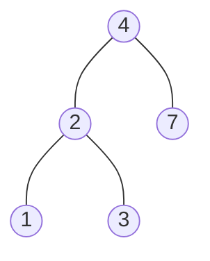

# Binary Search Tree (BST)

## Binary Search Tree

1. Binary Tree
2. Left subtree of a node contains only nodes with keys less than the node's key
3. Right subtree of a node contains only nodes with keys greater than the node's key
4. The left and right subtree each must also be a binary search tree
5. There must be no duplicate nodes
6. Inorder traversal of a BST gives a sorted list of keys



## LeetCode Problems

1. 0700 - [Search in a Binary Search Tree](https://leetcode.com/problems/search-in-a-binary-search-tree/) (Easy)
2. 0098 - [Validate Binary Search Tree](https://leetcode.com/problems/validate-binary-search-tree/) (Medium)
3. 0530 - [Minimum Absolute Difference in BST](https://leetcode.com/problems/minimum-absolute-difference-in-bst/) (Easy)
4. 0501 - [Find Mode in Binary Search Tree](https://leetcode.com/problems/find-mode-in-binary-search-tree/) (Easy)
5. 0235 - [Lowest Common Ancestor of a Binary Search Tree](https://leetcode.com/problems/lowest-common-ancestor-of-a-binary-search-tree/) (Easy)
6. 0701 - [Insert into a Binary Search Tree](https://leetcode.com/problems/insert-into-a-binary-search-tree/) (Medium)
7. 0450 - [Delete Node in a BST](https://leetcode.com/problems/delete-node-in-a-bst/) (Medium)
8. 0669 - [Trim a Binary Search Tree](https://leetcode.com/problems/trim-a-binary-search-tree/) (Medium)
9. 0108 - [Convert Sorted Array to Binary Search Tree](https://leetcode.com/problems/convert-sorted-array-to-binary-search-tree/) (Easy)
10. 0109 - [Convert Sorted List to Binary Search Tree](https://leetcode.com/problems/convert-sorted-list-to-binary-search-tree/) (Medium)
11. 0538 - [Convert BST to Greater Tree](https://leetcode.com/problems/convert-bst-to-greater-tree/) (Easy)
12. 0230 - [Kth Smallest Element in a BST](https://leetcode.com/problems/kth-smallest-element-in-a-bst/) (Medium)
13. 0173 - [Binary Search Tree Iterator](https://leetcode.com/problems/binary-search-tree-iterator/) (Medium)
14. 1586 - [Binary Search Tree Iterator II](https://leetcode.com/problems/binary-search-tree-iterator-ii/) (Medium)

## 700. Search in a Binary Search Tree

```python
--8<-- "0700_search_in_a_binary_search_tree.py"
```

## 98. Validate Binary Search Tree

```python
--8<-- "0098_validate_binary_search_tree.py"
```

## 530. Minimum Absolute Difference in BST

```python
--8<-- "0530_minimum_absolute_difference_in_bst.py"
```

## 501. Find Mode in Binary Search Tree

```python
--8<-- "0501_find_mode_in_binary_search_tree.py"
```

## 235. Lowest Common Ancestor of a Binary Search Tree

```python
--8<-- "0235_lowest_common_ancestor_of_a_binary_search_tree.py"
```

## 701. Insert into a Binary Search Tree

```python
--8<-- "0701_insert_into_a_binary_search_tree.py"
```

## 450. Delete Node in a BST

```python
--8<-- "0450_delete_node_in_a_bst.py"
```

## 669. Trim a Binary Search Tree

```python
--8<-- "0669_trim_a_binary_search_tree.py"
```

## 108. Convert Sorted Array to Binary Search Tree

```python
--8<-- "0108_convert_sorted_array_to_binary_search_tree.py"
```

## 109. Convert Sorted List to Binary Search Tree


```python
--8<-- "0109_convert_sorted_list_to_binary_search_tree.py"
```

## 538. Convert BST to Greater Tree


```python
--8<-- "0538_convert_bst_to_greater_tree.py"
```

## 230. Kth Smallest Element in a BST

```python
--8<-- "0230_kth_smallest_element_in_a_bst.py"
```

## 173. Binary Search Tree Iterator

```python
--8<-- "0173_binary_search_tree_iterator.py"
```

## 1586. Binary Search Tree Iterator II

```python
--8<-- "1586_binary_search_tree_iterator_ii.py"
```
