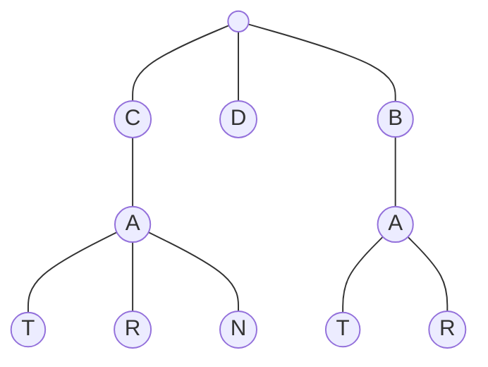

# Trie (Prefix Tree)

## Trie

-   A trie is a tree-like data structure whose nodes store the letters of an alphabet.



## LeetCode Problems

1. 0208 - [Implement Trie (Prefix Tree)](https://leetcode.com/problems/implement-trie-prefix-tree/) | [实现 Trie (前缀树)](https://leetcode.cn/problems/implement-trie-prefix-tree/) (Medium)
2. 0211 - [Add and Search Word - Data structure design](https://leetcode.com/problems/add-and-search-word-data-structure-design/) | [添加与搜索单词 - 数据结构设计](https://leetcode.cn/problems/add-and-search-word-data-structure-design/) (Medium)
3. 0212 - [Word Search II](https://leetcode.com/problems/word-search-ii/) | [单词搜索 II](https://leetcode.cn/problems/word-search-ii/) (Hard)

```python
--8<-- "template/trie.py"
```

## 208. Implement Trie (Prefix Tree)

```python
--8<-- "0208_implement_trie_prefix_tree.py"
```

## 211. Add and Search Word - Data structure design

```python
--8<-- "0211_add_and_search_word_data_structure_design.py"
```

## 212. Word Search II

```python
--8<-- "0212_word_search_ii.py"
```
